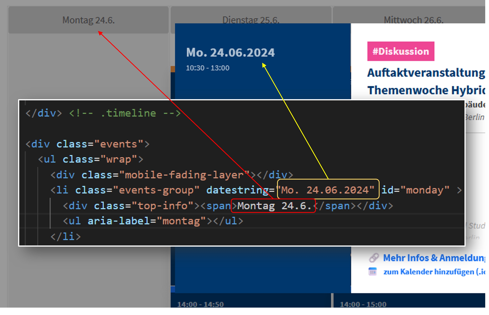

# Instructions for using the calendar

## Tools needed:
* Download and install [Github for Desktop](https://github.com/apps/desktop) and clone the repository ``bolognalab.github.io``. You should now have a folder structure on your PC that exactly matches this repository.
* Download and install [VSCode](https://code.visualstudio.com/)
* Install the VSCode extensions [LiveServer](https://marketplace.visualstudio.com/items?itemName=ritwickdey.LiveServer) and [Python](https://marketplace.visualstudio.com/items?itemName=ms-python.python). **LiveServer** helps you preview the website before it's published and Python is used to automate some processes (which you can also do yourself by spending a lot more time).

## Preparation
* You need a CSV file similar to ``/themenwoche-2024/files/programm-themenwoche.csv.`` Note the difference between "start"/"end" and "start-ovr"/"end-ovr"! The "start" and "end" times (currently only in 30-min increments) dictate the position and height of the event's rectangle on the program, but may be different from the actual time of the event. The "start-ovr" and "end-ovr" times ("override") are the actual start and end time of the event. Each event should be assigned an ``id``, e.g. "Auftaktveranstaltung" has the id ``event-auftakt`` defined in the CSV file.
* You need to have an "events directory" HTML file similar to ``/themenwoche-2024/calendar-events/events-dir.html.`` that contains ``div`` elements for all events. The ``id`` attribute of each ``div`` should match the ``id`` of the event exactly. You can do this manually (which takes time), or you can do it automatically by running the file ``/themenwoche-2024/calendar-events/directory-generator.py`` once.
* If you want the ability for the user to add the events to the calendar: Create calendar entries for all of the events in your Calendar software of choice (e.g. Thunderbird)

## Instructions
* Create a folder for your calendar (e.g. ``/themenwoche-2024``) and copy all the contents from the ``themenwoche-sample`` folder

### Setting the days of the week
In the file ``programm_cal.html``, find ``
`` - inside it you will find a list of empty lists (``li``) items grouped by the day of the week. Adjust the ``datestring`` attribute of the ``li`` items as well as the text of the ``div`` element inside it to match the dates of the event.

What you write as the ``datestring`` attribute will appear on the "modal" of the event, whereas what you write as text inside the ``div`` will appear on top of the program.

