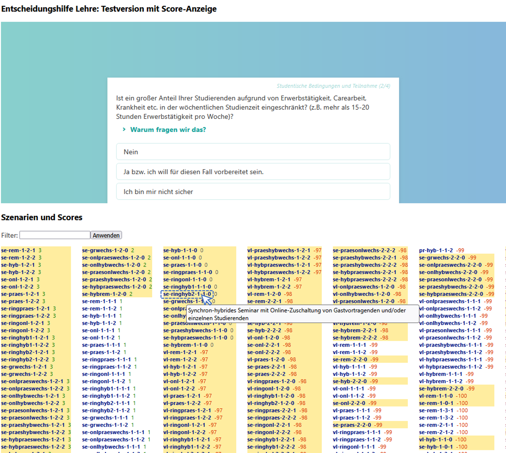

# Entscheidungshilfe Online & Hybride Lehre
*ein Tool des Berliner Netzwerks Hybride Lehre*

## Zielgruppe
### Ziel und Zielgruppe des Tools

Der Entscheidungsbaum richtet sich an Lehrende (nicht nur HU-Lehrende), die eventuell eine Lehrveranstaltung (LV) in einem neuen Format als vorher unterrichten möchten (Use-Case 1) oder schon das Format kennen (Use-Case 2) und didaktische und technische Tipps für die Durchführung durchlesen möchten. Für Use-Case 1 hilft der Entscheidungsbaum den Lehrenden, je nach ihren Präferenzen und anderen Voraussetzungen ein passendes Lernszenario für sich zu finden (online, hybrid, vor Ort, oder abwechselnd). Für Use-Case 2 wählt die Lehrende Person das Lernszenario im Voraus und beantwortet ein paar zusätzliche Fragen (z.B. wie viel studentische Interaktion gewünscht ist). Bei beiden Use-Cases erhält die Lehrende Person am Ende didaktische und technische Tipps im Zusatz zu Informationen über das Lehr-Lernszenario.

### Ziel und Zielgruppe dieser Dokumentation
Diese Dokumentation dient dem Verständnis der "Backend"-Struktur des Tools, ohne das Programmierkenntnisse in JavaScript oder Python benötigt wird. Anhand dieser Dokumentation sollte jemand in der Lage sein, Texte in dem Entscheidungstool zu bearbeiten und Texte/Tipps zuzuordnen, sowie die Frage-Formulierungen anpassen. Diese Inhalte befinden sich hauptsächlich in ``.csv`` und ``.json``-Dateien, die bearbeitet werden können. Das hinzufügen von neuen Fragen, Antwortmöglichkeiten, Funktionen oder anderen Inhalten benötigt mindestens ein Grundverständnis von JavaScript, Python, HTML und CSS. 

## Vorschau

URL zur letzten Version: <https://bolognalab.github.io/entscheidungshilfe-lehre/app.html> oder <https://pages.cms.hu-berlin.de/netzwerk-hybride-lehre/entscheidungstool>

Direkt zu einem Beispiel-Ergebnis: <https://bolognalab.github.io/entscheidungshilfe-lehre/var_result.html>

Mit „Programm“ wird unten die HTML-Seite des Entscheidungsbaums gemeint, die auf Github gehostet ist.

## Struktur

### Ergebnisse des Entscheidungsbaums

#### Lehr- / Lernszenarien

Es werden grundsätzlich 33 verschiedene Lehr-/Lernszenarien als Ergebnisse des Entscheidungsbaums abgebildet (14 “Vorlesungen”, 15 “Seminare” und 4 “Praktika” und “Sonstige”). Für jedes Szenario sind viele unterschiedliche Kombinationen **der folgenden drei Variablen**, möglich, weshalb sich am Ende ganz viele (über 800) mögliche Ergebnisse aus dem Entscheidungsbaum ergeben könnten:

- **Umfang der synchronen Interaktion (Variabel ``syncInt``)**: wie viel Interaktion innerhalb der Sitzungen der LV stattfindet:
  - 0 = gering – nur gelegentliche Interaktivität (frontaler Unterricht)
  - 1 = mittlere - aktive Beteiligung der Studierende, allerdings keine intensive Gruppenarbeit
  - 2 = hohe - aktive Beteiligung und regelmäßige Gruppenarbeit
- **Anteil der asynchronen Teilnahme (Variabel ``asyncTN``):** welchen Anteil bzw. welche Komponenten der LV online stattfinden:
  - 0 = exklusiv synchron
  - 1 = ergänzende Materialien für Nacharbeit
  - 2 = ergänzende Materialien für Vor- (Flipped Classroom) und Nacharbeit
  - 3 = asynchrone Teilnahme als möglicher Ersatz der synchr. Teilnahme
  - 4 = exklusiv asynchron
- **Umfang der asynchronen Interaktion (Variabel ``asyncInt``)**: wie viel studentische Interaktion außerhalb der Kurssitzungen gewünscht ist und inwieweit die Lehrperson diese Interaktion strukturieren möchte
  - 0 = minimal; keine Strukturierung der asynchronen Interaktion für Studierende und minimale Bereitstellung von Ressourcen dafür. Angebote für Interaktion mit der Lehrperson werden trotzdem empfohlen, z.B. Sprechstunden, Helpdesk, E-Mail, individuelles Feedback zu eingereichten Aufgaben
  - 1 = Bereitstellung von Strukturen, damit einzelne Studierende miteinander interagieren können, ohne explizite Aufforderung oder Anreiz, dass sie diese Angebote nutzen z.B. Forum, Q&A, Peer-Feedback
  - 2 = Bereitstellung von Strukturen für St-LP und St-St interaktion und Anreize, sie zu benutzen

Die drei Variablen beeinflussen, welche Tipps im Ergebnis angezeigt werden. Anmerkung: manche Kombinationen sind aus logischen Gründen nicht möglich (z.B. ``asyncTN = 0`` & ``asyncInt =2``).

Jedes mögliche Ergebnis wird im Programm mit einem Code \[xx-yy...y-#-#-#\] beschrieben (z.B. vl-praes-2-1-2), der diese Parameter berücksichtigt:

| Parameter \[``kurznotation``\] | Art der LV | Format | Synchrone Interaktion   \[``syncInt``\] | Asynchrone Teilnahme  \[``asyncTN``\] | Asynchrone Interaktion   \[``asyncInt``\] |
| --- | --- | --- | --- | --- | --- |
| Bsp: | Vorlesung | in Präsenz | hohe synchrone Interaktion | ergänzende Nacharbeit | St-LP und St-St |
| Code: | ``vl`` | ``praes`` | ``2``| ``1`` | ``2`` |

Die aktuelle Liste der Lernszenarien (alle Kombinationen) befindet sich in der Datei [**szenarien.csv**](https://github.com/bolognalab/bolognalab.github.io/blob/main/entscheidungshilfe-lehre/szenarien.csv/).

#### Blöcke

Jedes angezeigte Ergebnis des Entscheidungsbaums wird in mindestens **5 Blöcken** aufgeteilt (s. Abbildung), jeder mit einem kleinen Text und Inhalten wie Tipps. Die Blöcke sind folgende:  

- **Titel**  
    Der Titel des Lernszenarios wird wie von der Datei **texts_tips_matrix.xlsx** (im Programm ist das eine CSV-Datei, text_tips_matrix.csv) aufgerufen. Anmerkung: der Titel ändert sich in der Regel nicht, wenn die Variablen für synchrone Interaktion (_syncInt_), asynchrone Teilnahme (_syncTN_) oder asynchrone Interaktion (_asyncInt_) sich ändern – es hängt nur von der Art der LV und dem „Format“ ab, mit _einer Ausnahme:_ wenn die Variable für asynchrone Teilnahme den Wert von 3 hat („asynchrone Teilnahme als möglicher Ersatz der synchronen Teilnahme“), dann erscheint als Untertitel der Text „mit asynchroner Teilnahme-Alternative“, damit es für die Lehrperson deutlicher wird.  

- **Block 1 - Übersicht:**  
    Hier steht eine Beschreibung des Lehr-Lernszenarios und idealerweise auch ein schönes, repräsentatives Bild dazu.  
     Noch nicht implementierte Idee: **Begründung der Wahl**. Es könnte nützlich für den User sein (in Use-Case 1) zu verstehen, wie die Beantwortung der Fragen das Ergebnis beeinflusst hat. Dafür müsste das Programm in ein paar Sätze erklären, warum für bestimmte Antworten ein bestimmter Vorschlag gemacht wird. Das zu automatisieren braucht aber zusätzliche Arbeit und könnte später in der Entwicklung passieren.  

- **Block 2 – Tipps für die synchrone Interaktion**  
    Hier steht ein kleiner Text, der den Umfang der synchronen Interaktion (je nach den Angaben der Lehrenden) grob erklärt. Nebenbei erscheinen Tipps für die synchrone Interaktion. Die Inhalte dieses Blocks hängen hauptsächlich von dem Parameter „Synchrone Interaktion“ des Ergebnisses (erste der drei Zahlen im Code).  

- **Block 3 – Tipps für die asynchrone Interaktion**
    Hier wird ein Überblick der asynchronen Teilnahme und Interaktion gegeben zusammen mit Tipps für die Strukturierung der asynchronen Kurskomponenten. Die Inhalte dieses Blocks hängen sowohl von dem Parameter „Asynchrone Teilnahme“ und dem Parameter „Asynchrone Interaktion“ ab (zweite und dritte Zahl im Code).  

- **Block 4 – Medientechnische Voraussetzungen**
    Hier werden in Textform wichtige Raum- und Medientechnikvoraussetzungen kurz beschrieben, die dann in einem PDF-Dokument detailliert und abgebildet werden. Zusätzlich können für bestimmte Fälle Links zu interessanten Beispiele oder neue, inspirierende Raumkonzepte angegeben werden.   Die genaue Struktur der technischen Informationen steht noch nicht fest; die aktuelle Idee ist, dass auf einer Seite des PDFs die folgenden abgebildet werden:
  - die notwendige Raumausstattung
  - die technischen Komponenten und ihre Verbindung/Set-Up miteinander, und
  - eine Liste von Tipps für Lehrende

- **Block 5 – Weitere Ergebnisse**  
    Hier werden alternative Szenarien gezeigt, falls sie auch je nach den Angaben der Nutzer\*innen relevant sind. Der Text dazu ist immer gleich „Folgende Lehr-/Lernszenarien könnten auch für Sie passend sein:“

*Abbildung 1. Die 5 Blöcke der Ergebnisseite*

#### Texte und ihre Zuordnung

Die Texte für Blöcke 1, 2 und 3 befinden sich in der Quelldatei [texts_tips_matrix.csv](https://github.com/bolognalab/bolognalab.github.io/blob/main/entscheidungshilfe-lehre/texts_tips_matrix.csv) und werden automatisch je nach den Parametern des Ergebnisses abgerufen und angezeigt. In der Quelldatei enthalten die ersten zwei Spalten der Tabelle das allgemeine Format des Szenarios und die anderen Spalten die Texte, die in jedem Block passen. Weil der angezeigte Text von den Werten der Parameter ``syncInt``, ``asyncTN`` und ``asyncInt`` abhängt, gibt es für jedes allgemeine Format verschiedene Alternativen:

Tabelle 1 - Struktur der Datei "texts_tips_matrix" (für Texte) mit einem Beispiel

| A   | B   | C   | D   | _..._ | I   | _..._ |
| --- | --- | --- | --- | --- | --- | --- |
| **wert** | **Name** | **text_overview** | **text_syncInt-0** | **_…_** | **text_asyncTN-2** | **_…_** |
| de-default | Standardszenario   (Im Standardszenario sind Texte gespeichert, die in allen Szenarien verwendet werden können) | Dieser Text sollte nie angezeigt werden, solange alle Szenarien unten einen Überblicktext haben! | Wenn syncInt=0, wird dieser Text in Block 2 angezeigt. Wenn in dieser Spalte für ein bestimmtes Szenario ein anderer Text steht, wird der szenariospezifische Text diesen Text überschreiben. | …   | Wenn asyncTN=2, wird dieser Text in Block 3 angezeigt. Wenn in dieser Spalte für ein bestimmtes Szenario ein anderer Text steht, wird der szenariospezifische Text diesen Text überschreiben. | …   |
| vl-rem | Standort-übergreifende Kollaborative Vorlesung (Partnerkurse) | Dieser Text wird für alle Ergebnisse mit „vl-rem-#-#-#“ in Block 1 erscheinen. | \-  | …   | Dieser Text wird den oberen Text überschreiben. | …   |
| …   | …   | …   | …   | …   | …   | …   |

Wenn man also den Inhalt der Texte korrigieren oder ergänzen möchte, würde man die Quelldatei [texts_tips_matrix.csv](https://github.com/bolognalab/bolognalab.github.io/blob/main/entscheidungshilfe-lehre/texts_tips_matrix.csv) bearbeiten.

Anmerkung: weil die Parameter ``asyncTN`` und ``asyncInt`` sich beide auf dem Block 3 beziehen, werden die beiden Texte nebeneinander gezeigt (s. [Abbildung: Beispiel Szenario und Quellen verschiedener Inhalte](#contentSrcs) ).

#### Tipps und ihre Zuordnung

Für jedes Lehr-/Lernszenario erscheinen im Ergebnis eine bestimmte Reihe von didaktischen Tipps. Die Tipps sind in zwei Blöcken kategorisiert, einer „für die synchrone Interaktion“ und einer „für die asynchrone Teilnahme.“ Unter bestimmten „Spezialfällen“ (s. unten) können auch zusätzliche Blöcke mit Tipps erscheinen.

Der Inhalt jedes Tipps wird in einer Datei Namens [tips_source.json](https://github.com/bolognalab/bolognalab.github.io/blob/main/entscheidungshilfe-lehre/tips_source.json) gespeichert. Die folgende Abbildung erklärt (hoffentlich!) den Aufbau dieser Datei.

*Abbildung 2. Aufbau der Datei tips_source.json*

Die Information, welcher Tipp zu welchem Lehr-/Lernszenario unter welchen Bedingungen passt, wird durch die Datei [texts_tips_matrix.csv](https://github.com/bolognalab/bolognalab.github.io/blob/main/entscheidungshilfe-lehre/texts_tips_matrix.csv) festgelegt (wo auch die Texte sich befinden). Da werden unter verschiedene Spalten die Codes der Tips (z.B. „privateEcke“) aufgelistet, die erscheinen sollen.

Tabelle 2. Struktur der Datei "texts_tips_matrix" (für Tipps)

| A   | ... | O   | P   | _..._ | U   | _..._ |
| --- | --- | --- | --- | --- | --- | --- |
| **wert** | **…** | **tips_general** | **tips_syncInt-0** | **_…_** | **tips_asyncTN-2** | **_…_** |
| ... | ... | ... | ... | ... | ... | ... |
| vl-rem | …   | \[Tippcodes von Tipps, die _immer_ bei diesem Lehrformat erscheinen sollen\] | \[Tippcodes, die bei diesem Lehrformat erscheinen sollen, wenn syncInt=0\] | …   | \[Tippcodes, die bei diesem Lehrformat erscheinen sollen, wenn asyncTN=2\] | …   |
| …   | …   | …   | …   | …   | …   | …   |

Es ist wichtig für das Programm, dass die Tippcodes in einer Zelle der Tabelle mit Komma und einzelnem Leerzeichen getrennt sind, und _genau_ die Codes in der Datei **tips_source.json** anpassen, z.B.

privateEcke, warteZeitHyb, darstellungsformen

#### Medientechnische Voraussetzungen
Die Organisation der Informationen zu Medientechnik in Dateien ist gerade in Entwicklung. Im Moment werden verschiedenen vor-Ort- und hybriden Szenarien Text und URL-Links für Raumkonzepte (die auf Sketchfab hochgeladen wurden) zugeordnet. Die Zuordnung wird in der Datei [texts_tips_matrix.csv](https://github.com/bolognalab/bolognalab.github.io/blob/main/entscheidungshilfe-lehre/texts_tips_matrix.csv) definiert.

#### Spezialfalle (Special Cases)
Zwischen Blöcken 3 (Tipps für die asynchrone Teilnahme) und 4 (Medientechnik) können ggf. zusätzliche Tipps/Texte für bestimmte Sonderfallen angezeigt werden. Hier wird qualitativ beschrieben, was bei den verschiedenen Spezialfällen passieren sollte.

<table><tbody><tr><th>
<strong>Fall</strong>
</th><th>
<strong>Implementiert?</strong>
</th></tr><tr><td>
<strong>Internationale Kollaboration (hybride Exkursion)</strong>
<ul><li>Ein Zusätzlicher Block „Tipps für internationale Kollaboration“ soll erscheinen</li><li>In dem Block „Tipps für internationale Kollaboration“ werden Tipps hinzugefügt, die in der Datei <strong>tips_source.json</strong> mit „type“: „international“ bezeichnet werden.<ul><li>Mehrsprachigkeit: Für Videoaufzeichnungen wo möglich Live-Untertitelung nutzen (-&gt; viele VC Systeme können das, ob die Funktion nutzbar/aktiviert ist, muss mit IT Services geklärt werden). Englisch i.d.R. gut, Deutsch geht so, Wechsel zwischen zwei Sprachen schwierig.</li><li>Übersetzungen: Live Übersetzung sind meistens noch ein zusätzlicher, kostenpflichtiger Service oder datenschutzrechtlich problematisch. Dokumente können asynchron zur Sinnerfassung inzwischen gut mit DeepL übersetzt werden (https://www.deepl.com/de/translator)</li><li>Dokumentation: Die meisten VC Plattformen können inzwischen automatisch Transkripte von Videokonferenzen generieren. Das funktioniert mit Englisch ganz gut, mit anderen Sprachen mäßig. Achtung: Die Software kann nur Beiträge der Online-Teilnehmer:innen namentlich zuordnen; bei Aufnahmen aus dem analogen Raum fällt im Nachhinein die Unterscheidung zwischen verschiedenen Sprecher:innen/Beiträgen schwer. Als wörtliche Mitschrift sind die Skripte sehr umfangreich und aufwendig in der Überarbeitung.</li></ul></li></ul></td><td>
Noch nicht
</td></tr><tr><td>
<strong>Hybride Exkursion (hybrideExkursion)</strong>
<ul><li>Ein Zusätzlicher Block „Tipps für Hybride Exkursionen“ soll erscheinen</li><li>Tipps werden für den Fall geschrieben; Quelle; <a href="https://www.e-teaching.org/praxis/hybride-lernraeume/stellvertreterexkursion">https://www.e-teaching.org/praxis/hybride-lernraeume/stellvertreterexkursion</a></li></ul></td><td>
Noch nicht
</td></tr><tr><td>
<strong>Online-Zuschaltung Lehrperson </strong>(Die Lehrperson ist online zugeschaltet, während Studierende mit einer moderierenden Person im Lehrraum sind)
<ul><li>Zusätzliche Tipps werden im Block für die synchrone Teilnahme hinzugefügt.<ul><li>Technik-Check vor der LV</li><li>Studierende als Moderator:innen vor Ort</li></ul></li></ul></td><td>
noch nicht
</td></tr></tbody></table>

#### Abbildung: Beispiel Szenario und Quellen verschiedener Inhalte

Für das abgebildete Szenario **se-rem-1-1-0:**

*Abbildung 3. Quelle aller Texte und Tipps im Ergebnis*

### Fragen und Entscheidungen

#### Inhalte der Fragen

Die Fragen und Antworten können in der Datei [fragen_source.json](https://github.com/bolognalab/bolognalab.github.io/blob/main/entscheidungshilfe-lehre/fragen_source.json). Eine Frage wird durch das folgende beschrieben (s. Abbildung):

- Einen für die Nutzer\*innen unsichtbaren **Fragecode** (z.B. „onlBereit“)
- Eine Bedingung (**_condition_**) dafür, wann die Frage erscheint (je nachdem, wie frühere Fragen beantwortet wurden) – _true_ heißt, die Frage erscheint immer
- Den **text** der Frage
- Eine Reihe von **antworten**. Jede Antwort hat einen für die Nutzer\*innen unsichtbaren **Antwortcode** (z.B. „kein“, „geleg“) und einen Text. Die Texte für die Frage und Antworten unterstützen Formatierung durch HTML, z.B. &lt;b&gt;&lt;/b&gt; für bold.
- Eventuell einen Satz als zusätzliche Information (**addInfo**), welche die Frage länger erklärt.
*TODO: Dieses "addInfo" Element wird weiterentwickelt, weil inzwischen festgestellt wurde, dass für die sinnvolle Beantwortung der Fragen mehr Kontext notwendig ist.*

*Abbildung 4. Eine Beispiel-Frage in der Datei fragen_source.md und ihre Abbildung im Entscheidungsbaum-App*

Anmerkung 1: die _Reihenfolge_ der Fragen wird nicht durch diese Datei bestimmt, sondern sie wird durch eine andere Datei ([app.html](https://github.com/bolognalab/bolognalab.github.io/blob/main/entscheidungshilfe-lehre/app.html)) definiert. Dort gibt es die Javascript-Variable ``questionOrder``, welche die Codes der verwendeten Fragen in der gewünschten Reihenfolge auflistet.

**Anmerkung 2 (Wichtig!): manche Fragen in der Datei [fragen_source.json](https://github.com/bolognalab/bolognalab.github.io/blob/main/entscheidungshilfe-lehre/fragen_source.json) sind nicht mehr im Entscheidungstool implementiert!!!** Diese Datei dient auch als Archiv für ältere Fragen. Die aktuellste Auswahl der Fragen wird (wie die Reihenfolge) in der Datei [app.html](https://github.com/bolognalab/bolognalab.github.io/blob/main/entscheidungshilfe-lehre/app.html) definiert.

#### Beantwortung der Fragen – Punktvergabe (Scores)

Wenn ein\*e Nutzer\*in sich am Anfang des Entscheidungsbaums befindet, erstellt das Programm im Hintergrund eine Liste mit allen möglichen Ergebnissen (über 700), denen jeweils eine Startpunktzahl (**„Score“**) von 0 zugewiesen wird. Während der/die Nutzer\*in die Fragen beantwortet, werden einige Ergebnisse begünstigt (ihr Score steigt), andere benachteiligt (ihr Score sinkt), einige werden sofort ausgeschlossen (ihr Score sinkt auf -100) und andere bleiben unverändert. Am Ende der Beantwortung wird das Ergebnis mit dem höchsten Score angezeigt und bis 4 weitere Szenarien („top Tier“) als „weitere Ergebnisse“ vorgeschlagen. Ob und wie viele alternative Szenarien gezeigt werden hängt davon ab, wie stark ihre Scores voneinander abweichen.

Die Regeln, die festlegen, wie sich die Art der Beantwortung der einzelnen Fragen auf dem Score der verschiedenen Ergebnisse auswirkt, werden in der Datei [setQuestionsRules.py](https://github.com/bolognalab/bolognalab.github.io/blob/main/entscheidungshilfe-lehre/setQuestionsRules.py) geschrieben. Wenn dieses Python-Skript aufgeführt wird, dann werden alle Regeln als "Effekte" einer Antwortmöglichkeit auf die Punktzahl eines Szenarios in der Datei [data.json](https://github.com/bolognalab/bolognalab.github.io/blob/main/entscheidungshilfe-lehre/data.json) gespeichert. In der Python-Datei ist auch die Logik hinter der Regeln in englischer Sprache kurz durch Kommentare erklärt.

Zusätzlich können auf der Seite <https://bolognalab.github.io/entscheidungshilfe-lehre/app-flow.html> die Regeln in Praxis getestet werden, indem man die Fragen beantwortet und gleich den Einfluss auf die Scores der Ergebnisse sehen kann (Abbildung 5).

*Abbildung 5. Screenshot aus der Seite app-flow.html*
