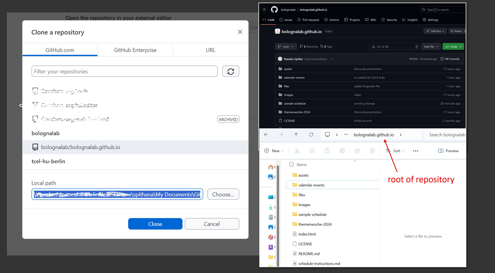
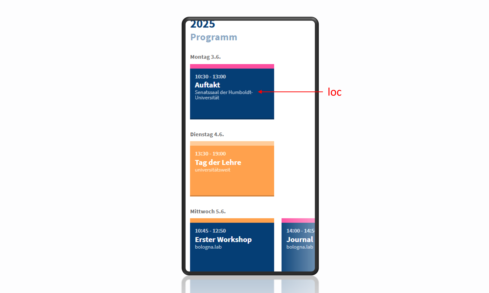
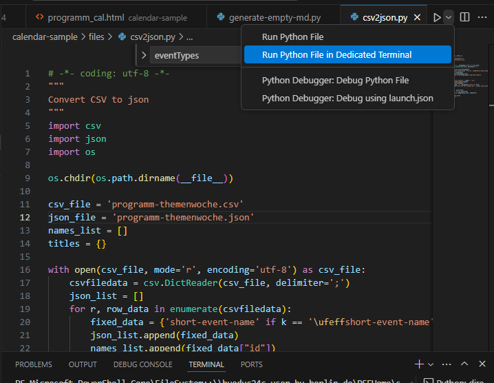
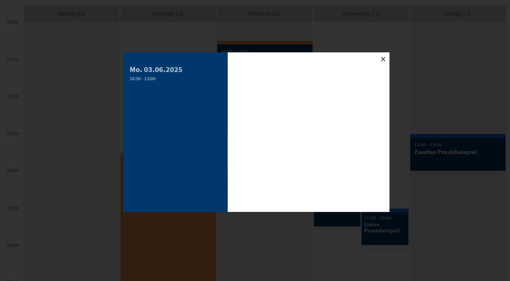
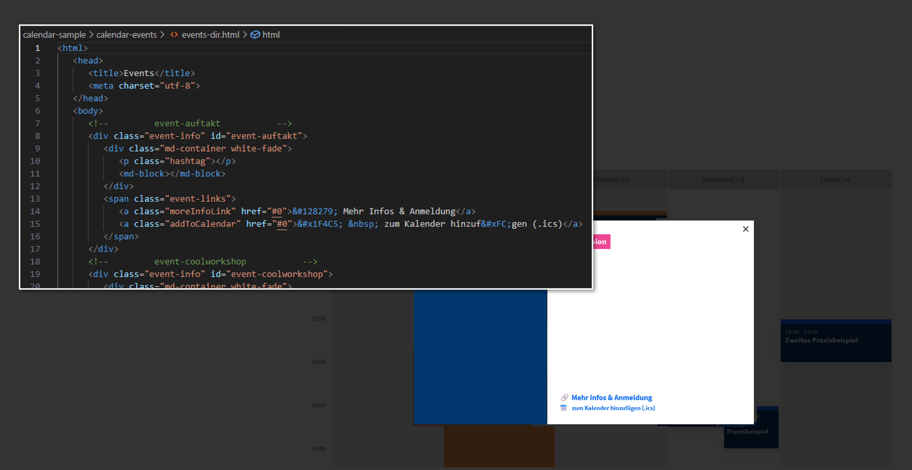

# Instructions for creating a new events schedule

## Preparation: 
### Tools needed:
* Download and install [Github for Desktop](https://github.com/apps/desktop) and clone the repository ``bolognalab.github.io``. You should now have a folder structure on your PC, in the path that you specified, which exactly matches the folder structure of the Github repository. The "root" of the repository is the folder where the instructions you are reading right now are located!



* Download and install [Visual Studio Code](https://code.visualstudio.com/) (VSCode).

* Install the VSCode extensions [LiveServer](https://marketplace.visualstudio.com/items?itemName=ritwickdey.LiveServer) and [Python](https://marketplace.visualstudio.com/items?itemName=ms-python.python). **LiveServer** helps you preview the website before it's published and Python is used to automate some processes (which you can also do yourself by spending a lot more time).

### List of events as CSV
You need a CSV file similar to ``/themenwoche-2024/files/programm-themenwoche.csv`` that lists your events. The file should be called ``programm-themenwoche.csv`` and have the same exact columns as the example files. For each event you should define:

* A short title ``short-event-name``, which should fit nicely in the rectangles of the program. After setting up the schedule, you may want to adjust the ``short-event-name`` further, so that the title takes up no more than 3 lines and the words are divided meaningfully.

* The full event title (``long-event-name``).

* The ``day`` of the week (which should be written in English and in lowercase letters).

* The ``start`` and ``end`` times, which are not always the true start and end times of the event, but they dictate the position and the height of the event block on the program. **The ``start`` and ``end`` times only work in 30-minute increments!** The actual start and end times of the event, if they are different from the ``start`` and ``end``  values, should be written in the ``start-ovr`` and ``end-ovr`` columns ("ovr" stands for "overwrite").


* The location (``loc``) for the event; this should be a relatively short name. This will appear only on the mobile version under the short event title.



* Each event should be assigned an ``id``, e.g. "Auftaktveranstaltung" has the id ``event-auftakt`` defined in the CSV file. The ``id`` does not appear on the schedule but connects all information about the event together.

* The ``web`` property, which should be the URL where more information on the event is available (see [Individual pages for each event](#individual-pages-for-each-event)). If you don't know the URL yet, you can use a dummy URL such as the homepage of the HU and come back to edit it later.

* The ``category`` can be either ``event-1``, ``event-2``, ``event-3`` or ``event-4``. The colors of the event as well as the hashtag that appears on top of it is defined by the ``category`` variable. Currently, ``event-1`` is accented with pink and is assigned to #Diskussion, ``event-2`` is accented with blue and is assigned to #ImpulsFürDiePraxis and ``event-3`` is accented with orange and assigned to #Kompetenzentwicklung. To distinguish the events of the Themenwoche from "Tag der Lehre" we use the category ``event-4`` which looks different from the other 3. If you don't want to use the existing hashtags, you can change that later (See [Changing or removing the topic hashtags](#changing-or-removing-the-topic-hashtags))

### Individual pages for each event
* You can complete this step later, but it's good to already decide on the URLs of the pages (on the HU webpage) that will contain information on each event. After you decide on these URLs (whether the pages are ready or not), you can place them in the CSV file under the ``web`` column.

### Calendar Events
* If you want the ability for the user to add the events to their calendar: Create calendar entries for all of the events in your Calendar software of choice (e.g. Thunderbird). The calendar events should include the location and time and, ideally, a description that contains a link to event page on the HU webpage. It's best not to write any additional details in the calendar events, so that, if any information changes, it can all be edited in one place (the HU page).
You will later convert these calendar events to ICS files.

## Instructions
### 1. &nbsp; Setting up the new folder
* Make a copy of the folder ``sample-schedule`` and all of its contents, keep it in the root directory, and rename it according to your event (e.g. ``themenwoche-2025``). The URL of your new schedule will be: ``https://bolognalab.github.io/[YOUR FOLDER]``
* In the subfolder ``/[YOUR FOLDER]/calendar-events``, delete all files  **except** the following:
    * ``directory-generator.py``
    * ``generate-empty-ics.py``
    * ``generate-empty-md.py``. 
    * ``template.md`` 
* If you accidentally delete those files, you can find them in the ``sample-schedule`` folder.  
* In the subfolder ``/[YOUR FOLDER]/files``, delete the file ``programm-themenwoche.json`` and replace the file ``programm-themenwoche.csv`` with your own list of events. The file name and extension should stay the same!

The rest of the steps require a script editor such as VSCode.

* Open the repository's root folder on the "File Explorer" of VSCode. Navigate to the file ``/[YOUR FOLDER]/index.html`` and open it. Click on "Go Live" on the bottom right of the VSCode window (which should appear if you have installed the **LiveServer** extension). A browser webpage should now open with an empty schedule. The "URL" of this local "live preview" page should be something like ``http://127.0.0.1:5500/[YOUR FOLDER]/index.html``. If you want to change the dates that appear on the schedule, you can do it later (see [Setting the days of the week](#setting-the-days-of-the-week)).

* In the file ``/[YOUR FOLDER]/index.html``, find the first ``<h1>`` element in the ``<body>`` and change the title of the schedule to what you would like.

### 2. &nbsp; Placing the events on the schedule

* Open the file ``/[YOUR FOLDER]/files/csv2json.py`` and run it (this requires the Python extension as mentioned above). The message "json file created or updated successfully" should appear in the Python terminal, and the file ``programm-themenwoche.json`` should be generated again.



**Note: if you later want to change details about the events such as titles, location, or URL (which will most certainly happen!), you will need to update your CSV file and then repeat this step! As long as the ``id`` of each event stays the same, simply running the ``csv2json.py`` script should make the changes effective without any further steps needed.**

* If you cannot run Python, you'll have to create the ``programm-themenwoche.json`` file manually, which is easy but tedious and time-consuming. Also, if you do this manually, you will need to manually update the .json file and the .csv file every time you need to make small changes. Please use Python!

* After completing this step, all your events should now appear on the schedule in the live preview.  If you see errors in the schedule or if the Python file didn't run successfully, check your CSV file for errors.

* **Important: At this point, clicking on the event should bring up a blank modal window with just the date and time.** This is normal!



* If two of the events are coinciding with each other, they will appear on top of each other (also normal!). You can resolve this at a later stage, see [Showing conflicting events](#showing-conflicting-events), but you need to complete steps 3 & 4 beforehand.

### 3. &nbsp; Adding links to the event modal
* Clicking on each event in the schedule brings up the "modal" of the event, which should contain the time, title, location, and basic details of the event, as well as a link to "more information" and (optionally) a link for adding the event to the calendar. The structure of all that information lies in the file ``/[YOUR FOLDER]/calendar-events/events-dir.html`` and in markdown (``*.md``) files in the same folder, one for each event. In the next step, you will be creating these files.

* Create an "events directory" HTML file similar to ``/sample-schedule/calendar-events/events-dir.html``. In that file, there should be a ``div`` element for each event, and the ``id`` attribute of each ``div`` should match the ``id`` of the event exactly. The content of each event should also follow a very specific structure, which can be seen in the examples. **Doing this manually takes time and has lots of room for error, so it's recommended to do it automatically by running the script ``/[YOUR FOLDER]/calendar-events/directory-generator.py`` once.**

* After generating the file ``events-dir.html``, check the live preview. When clicking on an event, the modal window should open. The white space of the modal should be mostly empty, but there should now be a working link to "Mehr Infos & Anmeldung." Below it should also be a link "zum Kalender hinzufügen (.ics)", which doesn't work for now, because it's looking for an ``.ics`` file that doesn't exist yet. There may also be a hashtag depending on the event category (e.g. #Diskussion for ``event-1``).



### 4. &nbsp; Adding event details to the event modal
* This schedule uses [Markdown language](https://www.markdownguide.org/) to write event details (e.g. title, place, address, type of event, and people presenting). You will need one Markdown file for each event called ``[Event ID].md``. You can do this automatically in the next step!
* Run the script ``/[YOUR FOLDER]/calendar-events/generate-empty-md.py`` to generate templates of all events at once - this will use the ``long event name`` and ``id`` you defined for each event in your CSV file and will name the files correctly. In the live preview, if you click on an event, you should also now be able to see a title and more content in the modal window.


* Edit the individual Markdown files with the relevant information. The basic template should cover most of your needs, but you can take a look at ``/themenwoche-2024/calendar-events/event-auftakt.md`` and ``/themenwoche-2024/calendar-events/event-tdl.md`` for some other options.

### 5. &nbsp; Optional: Creating and linking ICS files
This step is optional but, if you choose **not** to include ICS files, you should manually delete the links "zum Kalender Hinzufügen" that appear on the modal of each event, see [Editing or removing the links for "More Information" and "Adding to Calendar"](#editing-or-removing-the-links-for-more-information-and-adding-to-calendar)! Here are the steps for including ICS files:

* Run the Python script ``/[YOUR FOLDER]/calendar-events/generate-empty-ics.py`` to generate an ICS file for each of your events. ICS files are basically just text files with a "special" file extension and syntax. The files we just created have the correct file extension, but are still empty, so they are not useful yet.

* In your calendar program of choice, export each event as an ICS file. How you can do this varies from software to software. On Thunderbird, you can simply select an event, right-click on an event (Ctrl+Click on Mac), select "Copy", and then paste what you just copied in a text file. If you save that text file with the extension ``.ics``, you have successfully created the ICS file! In this project, we already have empty ICS files to work with, so simply paste the content you copied from your Thunderbird calendar into the corresponding ICS text file. 
* Save the ICS text file and repeat for all the events you want to add this feature to.

https://github.com/bolognalab/bolognalab.github.io/assets/23509977/c04472a5-8e69-469f-a0ff-ecb0fd44b979

Congratulations! The basic mechanics of your events schedule are ready! Now on to fine-tuning and updating:

### Setting the days of the week
In the file ``/[YOUR FOLDER]/programm_cal.html``, find ``<div class="events">`` - inside it you will find a list of empty lists (``li``) items grouped by the day of the week. Adjust the ``datestring`` attribute of the ``li`` items as well as the text of the ``div`` element inside it to match the dates of the event.

What you write as the ``datestring`` attribute will appear on the "modal" of the event, whereas what you write as text inside the ``div`` will appear on top of the program.


### Showing conflicting events
If two events are coinciding, you need to decide which one you will place on the left vs. the right (hopefully, you don't have more than 2 coinciding events)! The schedule is not smart enough to know which events are coinciding, so you need to specify it yourself:

* In the file ``/[YOUR FOLDER]/programm_cal.html``, navigate towards the bottom of the file, where most of the scripts are located. You will find two comments (``// Conflicts to place on the left/right``) that indicate the area of the code you need to edit. 


* Simply replace the strings inside the lists  ``conflictsLeft`` and ``conflictsRight`` with the ``id``'s of the events you want to squeeze to the left or to the right, respectively. If there are more than one pair of conflicting events, you want to add strings to both lists, e.g. if you also had the event "coolworkshop" coincide with the event "chemie" you would write:
```js 
// Conflicts to place on the left
const conflictsLeft = ["event-bigworkshop", "event-coolworkshop"]
// Conflicts to place on the right
const conflictsRight = ["event-musik", "event-chemie"]
```
* If there are no conflicting events (first of all, congratulations on your excellent planning!), you should redefine the variables ``conflictsLeft`` and ``conflictsRight`` as empty lists:
```js 
// Conflicts to place on the left
const conflictsLeft = []
// Conflicts to place on the right
const conflictsRight = []
```


### Editing or removing the links for "More Information" and "Adding to Calendar"
You can edit the file ``[YOUR FOLDER]/calendar-events/events-dir.html`` directly to more precisely define what appears on the white part of the modal of each event. Here are some examples.
* If you don't have an ICS file for an event (e.g. Tag der Lehre), you will want to remove the link "Zum Kalender Hinzufügen." To do so, scroll down on the event directory file until you find the event, and **remove** the following element:
```html
<a class="addToCalendar" href="#0">&#x1F4C5; &nbsp; zum Kalender hinzuf&#xFC;gen (.ics)</a>
```
* If an event doesn't have a pre-registration, then you can change the text "Mehr Infos & Anmeldung" to "Mehr Informationen", by **editing** the following element:
```html
<a class="moreInfoLink" href="#0">&#128279; Mehr Infos & Anmeldung</a>
```
* If you have some HTML knowledge, you can also add other elements to the modal. The contents of the the ``events-dir.html`` file define what goes on the white part of the modal, whereas the colorful part of the modal is defined in the ``programm_cal.html`` file.

### Changing or removing the topic hashtags
If you don't like the topics Diskussion, #ImpulsFürDiePraxis and #Kompetenzentwicklung, you can change them. In the ``/[YOUR FOLDER]/programm_cal.html`` file, right below the code for "squeezing" conflicting events, you will find an object matching each event category to a topic. If no topic is defined for an event category (as is the case for Tag der Lehre (``event-4``), then no hashtag will appear.)
```js
//define hashtags/topics for each event
const eventTypes = {
    "event-1": "Diskussion",
    "event-2": "ImpulsFürDiePraxis",
    "event-3": "Kompetenzentwicklung"
    }
```

### Don't like the colors or appearance of the schedule?
If you have some CSS knowledge, you can change more things about the appearance of the schedule. However, because all schedules on this webpage use the CSS stylesheet ``/assets/css/calendar.css``, you should NOT edit that file directly as it will impact all other schedules (e.g. Themenwoche 2024). Instead, you can make a copy of the CSS file, link it to the calendar you are working on, and then make any changes on the copy. To do this:
* Make a copy of the file ``calendar.css`` and rename it (e.g. ``calendar2025.css``)
* In both the files ``[YOUR FOLDER]/index.html`` and ``[YOUR FOLDER]/programm_cal.html``, edit the following line with the name of the new CSS file:
```html
<link rel="stylesheet" href="../assets/css/calendar.css" />
```
* Feel free to play around with the CSS as you wish, but be careful when changing the size of any element, as the events schedule should stay responsive for mobile devices!

* The same is true for the functionality of the event schedules: the functionality of all scheduules is controlled in ``/assets/js/calendarEvents.js`` - if you want to make changes, please make a copy of that file and edit ``[YOUR FOLDER]/programm_cal.html`` to link to the new file.